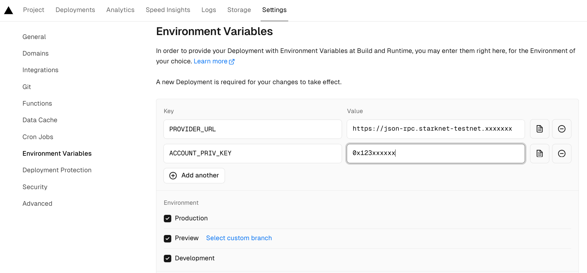

# Cairo1JS

> [!IMPORTANT]
> Stars are appreciated!

## Presentation

This small project demonstrates how to create a DAPP to interact with the Starknet blockchain.  
You can interact easily with Cairo smart-contract, using your Argent-X or Braavos wallets (installed in your desktop).  
The communication with the wallet can be made only with Wallets compatible with the new Wallet API.

Analyze the code to see how to create a such DAPP (start [here](https://github.com/PhilippeR26/Cairo1JS/blob/main/src/app/(site)/page.tsx))  

The DAPP is made in the Next.js framework. Coded in Typescript. Using React, Zustand context & Chaka-ui components.

## Getting Started 🚀

Create a `.env.local` file, containing : 
```bash
NEXT_PUBLIC_PROVIDER_URL = "your_Sepolia_node_url"
```
Run the development server:

```bash
npm i
npm run dev
```

Open [http://localhost:3000](http://localhost:3000) with your browser to see the result.  

## Deploy on Vercel 🎊

The easiest way to deploy your Next.js app is to use the [Vercel Platform](https://vercel.com/new?utm_medium=default-template&filter=next.js&utm_source=create-next-app&utm_campaign=create-next-app-readme) from the creators of Next.js.

Check out the [Next.js deployment documentation](https://nextjs.org/docs/deployment) for more details.

> You can test this DAPP ; it's already deployed at [https://cairo1-js.vercel.app/](https://cairo1-js.vercel.app/).

If you fork this repo, you need a Vercel account. You can configure your own environment variables for the Server side :  

